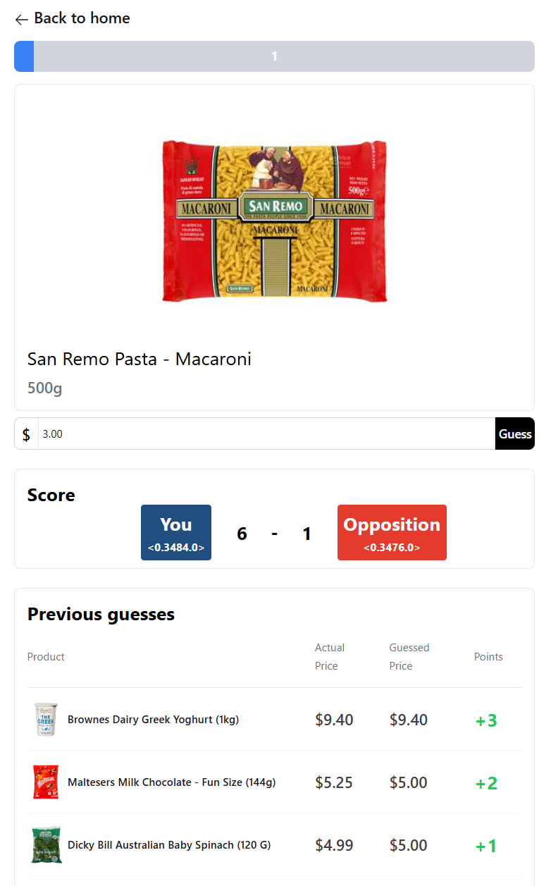

# **The Price Is Right Game**

This is a real-time pricing game built using **Phoenix LiveView**, which is built on top of the **Elixir** programming language. The application uses **SQLite** for data storage and **Tailwind CSS** for styling.

# **[Click here to visit the live demo](https://ntuc-price-is-right.fly.dev/)**

## Features

- **Real-time gameplay** using Phoenix's built-in PubSub library.
- **Matchmaking for multi-player mode** using Elixir's GenServer and each user's LiveView process PID.
- **Leaderboard** to track the highest scores.
- **Responsive design** using Tailwind CSS.



## Run Locally

To set up the application locally:

1. **Clone the repository:**

    ```bash
    git clone https://github.com/jialatteo/ntuc_the_price_is_right.git
    cd ntuc_the_price_is_right
    mix setup
    ```

2. **Set up the database:**

    Make sure you have PostgreSQL installed. Then run the following commands to create and migrate the database:

    ```bash
    mix ecto.create
    mix ecto.migrate
    ```

3. **Start the Phoenix server:**

    ```bash
    mix phx.server
    ```

    The app will be available at `http://localhost:4000`.

## Deployment

This application is deployed using **Fly.io**. The database and application are configured to run seamlessly in the cloud. You can view the live app [here](https://ntuc-price-is-right.fly.dev/).
